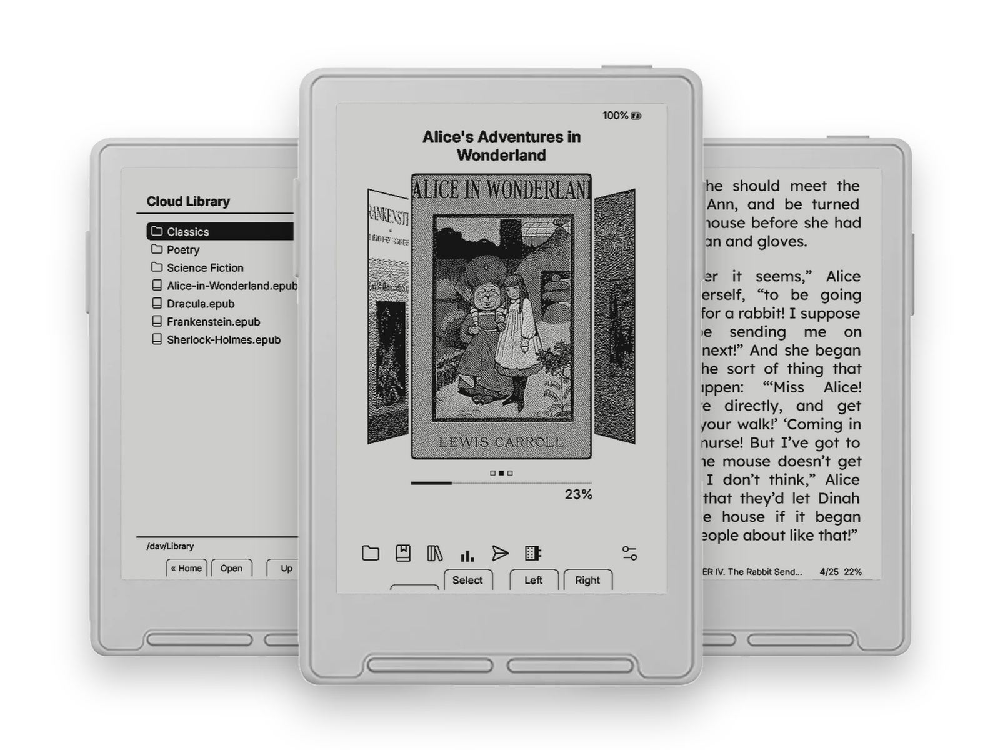
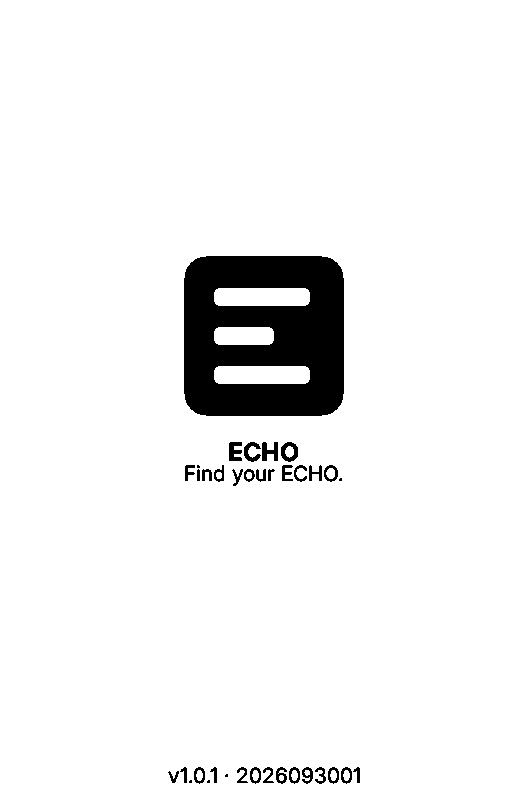
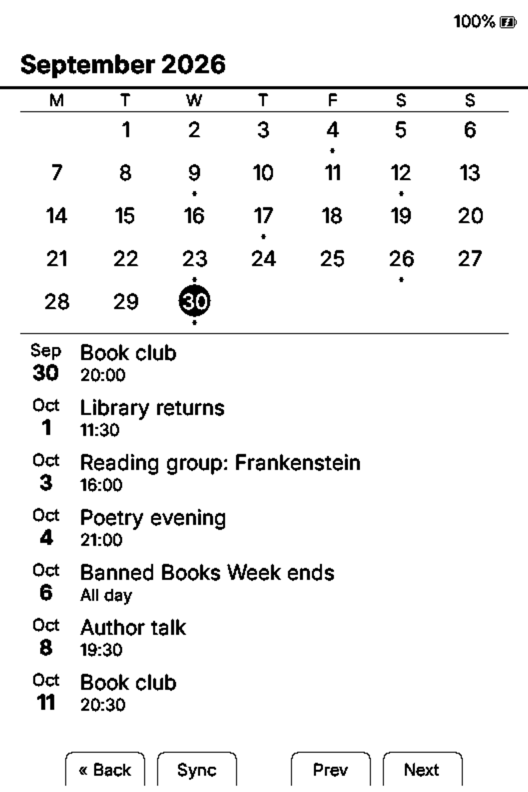
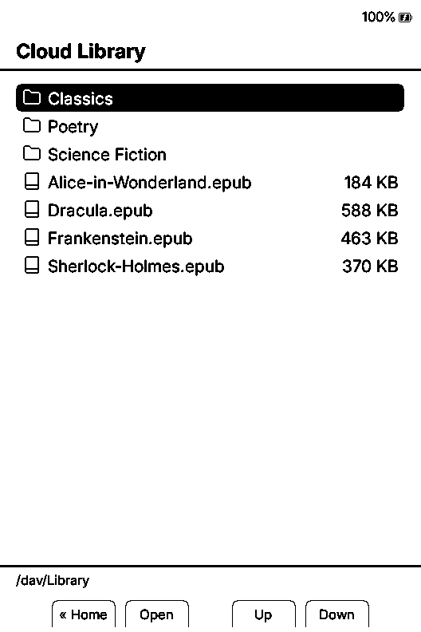

[🇬🇧 English](README.md)

# ECHO

<p align="center"></p>

<p align="center"><sub>Foto del dispositivo: Xteink. ECHO è un progetto indipendente, non affiliato a Xteink.</sub></p>


Firmware open source per e-reader Xteink X3 e X4.

> ECHO è un fork di [cpr-vcodex](https://github.com/franssjz/cpr-vcodex)
> di franssjz, a sua volta basato su
> [CrossPoint Reader](https://github.com/crosspoint-reader/crosspoint-reader).
> Le attribuzioni complete sono in [FORK_NOTICE.md](FORK_NOTICE.md).

## Download

Scarica il firmware per il tuo dispositivo dall'[**ultima release**](https://github.com/filippocobelli/Echo/releases/latest)
(le versioni precedenti sono nella pagina [Releases](https://github.com/filippocobelli/Echo/releases)).

| Dispositivo | File |
|-------------|------|
| Xteink X3 | `firmware_echo_x3_<versione>.bin` |
| Xteink X4 | `firmware_echo_x4_<versione>.bin` |

## Installazione

> **Uso a tuo rischio.** Questo firmware è fornito *così com'è*, senza
> alcuna garanzia. Installarlo è una tua scelta e una tua responsabilità: non
> rispondo di perdita di dati, malfunzionamenti o danni al dispositivo. Fai un
> backup prima di installare. Un firmware non ufficiale può far decadere la
> garanzia del produttore.

Web flasher: https://crosspointreader.com/#flash-tools (serve Chrome o Edge, per WebSerial).

- **X3:** dopo il flash scollega il cavo USB e ricollegalo. **Non** premere Reset.
- **X4:** dopo il flash premi Reset, poi tieni subito premuto Power per 3–5 secondi.
- **Recupero:** copia un firmware funzionante nella root della scheda SD, rinominandolo
  `force_update.bin`, poi riavvia. All'avvio ECHO trova il file, lo verifica, lo installa in
  automatico e si riavvia: nessun menu da navigare, che è proprio ciò che serve quando l'interfaccia
  non parte. L'immagine viene validata prima di scrivere qualsiasi cosa, quindi un file corrotto
  viene rifiutato invece di mettere fuori uso il dispositivo, e il file viene rinominato prima
  del flash, così un'installazione interrotta non può causare un boot loop. Puoi anche installare
  un `.bin` a scelta in modo interattivo da **Impostazioni > Sistema > Aggiornamento firmware da SD**.
  Se il dispositivo non si avvia affatto, reinstalla il firmware via USB dal web flasher.

## Dispositivi

| Dispositivo | Display | Risoluzione | Ruolo |
|-------------|---------|-------------|-------|
| Xteink X3 | 3,68" SSD1677 | 528×792 | ⭐ Principale |
| Xteink X4 | 4,26" SSD1680 | 800×480 | Secondario |

Entrambi montano un ESP32-C3 (RISC-V single-core a 160 MHz, senza PSRAM, circa 380 KB di RAM
utilizzabile), uno slot microSD su SPI, WiFi a 2,4 GHz e BLE. Compila e installa il binario
corrispondente al tuo dispositivo.

## Funzionalità

### 📚 Lettura
- EPUB 2/3, TXT e XTC, con indice, segnalibri e salto a una percentuale
- Tipografia CrossInk: ChareInk, Bitter e Lexend Deca per il testo, Inter per l'interfaccia
- Interlinea regolabile (70%–200%), corpo del testo da 9 a 16 pt, supporto emoji
- Sillabazione Liang per il testo giustificato: en, it, de, es, fr, ru, pl, sv, uk
- Bionic Reading, Guide Dots, rientri di paragrafo forzati
- Preferiti: tieni premuto su un libro nella libreria per fissarlo in cima
- Statistiche di lettura, heatmap, traguardi, obiettivo giornaliero e serie di giorni configurabili
- Sposta i libri finiti in una cartella `/Read/` dal menu del lettore
- Cambio pagina automatico con intervallo configurabile
- "Se trovato, restituiscimi": legge `/if_found.txt` dalla root della scheda SD

### 🗓 Calendario
- Feed iCal (`.ics`) via WiFi, con URL configurabile sul dispositivo
- Vista mensile (oggi evidenziato, un puntino sotto i giorni con eventi) con l'agenda dei prossimi eventi sotto
- Sinistra / Destra cambiano mese, Su / Giù scorrono l'agenda
- Salvato sulla scheda SD, quindi si apre anche senza rete

### 📖 Dizionario
- Dizionari StarDict letti da `/dictionaries/` sulla scheda SD
- Dizionari monolingua e bilingue
- Ricerca di una parola durante la lettura, con cronologia, più un'app Dizionario autonoma
- Solo `.dict` non compresso: `.dict.dz` non è supportato

### 🌐 Rete
- Browser OPDS, con vista a elenco o a griglia di copertine su due colonne
- Cloud Library: sfoglia e scarica libri da un drive WebDAV (Koofr, Nextcloud, ownCloud)
  - Koofr: usa una *password per le app* e inseriscila **senza spazi**
- Invio a dispositivo da Calibre-Web
- WebDAV: monta la scheda SD come unità di rete da Finder, Esplora file o File di iOS
- Aggiornamenti firmware OTA dalle release GitHub di questo repository
- KOReader Sync per la posizione di lettura tra dispositivi
- Interfaccia web per le impostazioni e caricamenti veloci via WebSocket da browser

### 💤 Schermata di sospensione
- Reading Dashboard: progresso dell'obiettivo giornaliero, serie di giorni, totale di oggi, ultimo libro, ultimo traguardo
- Immagini personalizzate dalla scheda SD, modalità copertina del libro, sequenziale o casuale

### 🔧 Sistema
- Recupero d'emergenza: metti `force_update.bin` nella root della SD e riavvia, l'installazione è automatica
- Aggiornamento firmware da SD, interattivo, dal menu delle impostazioni
- Schede SD exFAT e FAT32
- 24 lingue dell'interfaccia
- Riconoscimento automatico X3/X4 a runtime

## Screenshot

Catturati dal simulatore di ECHO a risoluzione nativa (528×792, Xteink X3), con dati di esempio e libri di pubblico dominio.

<table>
  <tr>
    <td align="center"><br><sub>Schermata di avvio</sub></td>
    <td align="center"><br><sub>Home — tema Lyra Carousel</sub></td>
    <td align="center"><br><sub>Pagina di lettura</sub></td>
  </tr>
  <tr>
    <td align="center"><br><sub>Calendario — vista mensile e agenda (iCal)</sub></td>
    <td align="center"><br><sub>Sospensione — Reading Dashboard</sub></td>
    <td align="center"><br><sub>Cloud Library via WebDAV</sub></td>
  </tr>
</table>

## Compilare dal sorgente

Requisiti: PlatformIO, Python 3.8+, SDL2 per il simulatore (`brew install sdl2`).

```bash
git clone --recursive https://github.com/filippocobelli/Echo
cd Echo

# Simulatore
pio run -e simulator
.pio/build/simulator/program

# Dispositivo
pio run -e echo_x3   # Xteink X3
pio run -e echo_x4   # Xteink X4
```

Il firmware si trova in `.pio/build/<env>/firmware.bin`. Le personalizzazioni locali di PlatformIO
vanno in `platformio.local.ini`, che non è tracciato.

## Crediti

| Progetto | Autore | Cosa abbiamo usato |
|----------|--------|--------------------|
| [CrossPoint Reader](https://github.com/crosspoint-reader/crosspoint-reader) | crosspoint-reader | Firmware di base, motore EPUB, framework UI, HAL |
| [cpr-vcodex](https://github.com/franssjz/cpr-vcodex) | franssjz | Base diretta del fork: analisi, traguardi, statistiche |
| [CrossInk](https://github.com/uxjulia/CrossInk) | uxjulia | Tipografia, font, varianti di build, simulatore |

Font: ChareInk (M. Ramsey, freeware), Bitter (Sol Matas, OFL), Lexend Deca
(Bonnie Shaver-Troup, OFL), Inter (Rasmus Andersson, OFL).

## Licenza

MIT — vedi [LICENSE](LICENSE).
